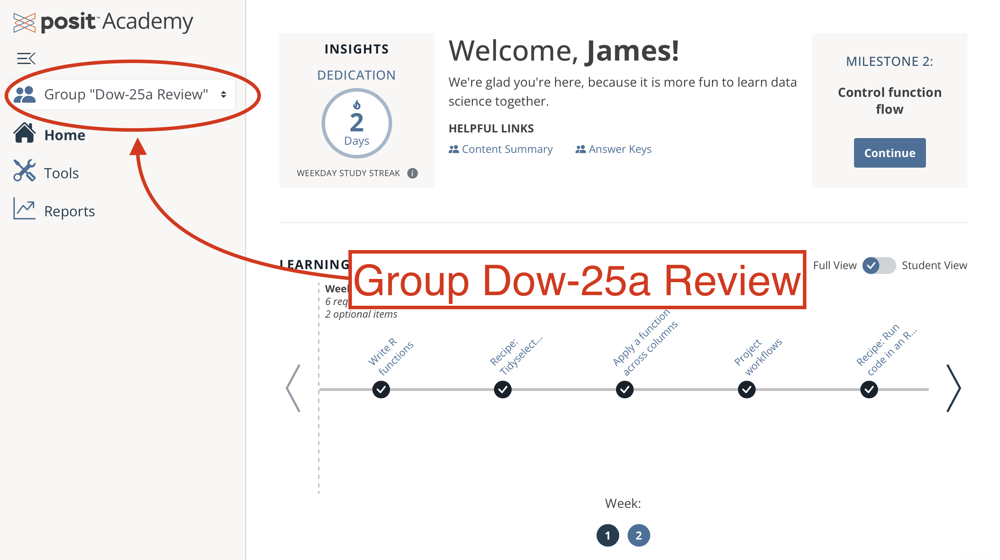



<!-- slides about course design -->



## Course Calendar {.slide-white}

```{r}
#| echo: false
library(tidyverse)
library(legendry)
mondays <- as.Date("2025-03-03") + 7*0:7
mondays <- c(mondays, rep(NA, 5))
wednesdays <- as.Date("2025-03-03") + 2 + 7*1:12
wednesdays[11] <- NA
wednesdays <- c(as.Date(NA), wednesdays)

simple_date <- function(x){
  month <- lubridate::month(x, label = TRUE, abbr = FALSE)
  day <- lubridate::mday(x)
  result <- paste(month, day)
  
  result[is.na(x)] <- ""
  
  result
}

calendar <- data.frame(
  index = 1:13,
  week = c("Welcome", 1:3, "Catch-Up", 4:5, "Catch-up", 6:8, "Working", 10),
  mon = simple_date(mondays),
  wed = simple_date(wednesdays),
  course = c(NA, rep("pinr", 7), rep("shiny", 5))
)

plot_calendar <- calendar |> 
  mutate(
    course = case_when(
      index == 1 ~ "welcome",
      .default = course),
    position = c("Welcome",
                 rep("Programming", 7),
                 rep("Shiny", 5))) |> 
  pivot_longer(
    cols = mon:wed,
    names_to = "day",
    values_to = "date"
  ) |> 
  mutate(
    day = day |> 
      str_replace_all("mon", "Monday") |>
      str_replace_all("wed", "Wednesday"),
    index = index * -1) |>
  ggplot(aes(
    x = day,
    y = index)) +
  geom_tile(
    aes(fill = course),
    alpha = 0.4, 
    color = "black", 
    show.legend = FALSE) +
  geom_rect(
    data = data.frame(
      day = "Monday",
      label = "Working Week",
      index = -12,
      ymin = -11.5,
      ymax = -12.5,
      xmin = 0.5,
      xmax = 2.5,
      course = "shiny"),
    aes(
      xmin = xmin, xmax = xmax,
      ymin = ymin, ymax = ymax, 
      fill = course),
    show.legend = FALSE) +
  geom_text(
    aes(label = date)) +
  theme_minimal() +
  theme(
    panel.grid.major = element_blank(),
    panel.grid.minor = element_blank()) +
  # ggokabeito::scale_fill_okabe_ito(breaks = c("pinr", "shiny")) +
  scale_fill_manual(
    values = c(
      "welcome" = "white",
      "pinr" = "#dfabee", 
      "shiny" = "#94c4f2"),
    breaks = c("pinr", "shiny")) +
  labs(y = NULL, x = NULL) +
  scale_x_discrete(position = "top") +
  scale_y_discrete(
    expand = c(0,0),
    guide = guide_axis_nested(
      regular_key = "none",
      bracket = "curvy",
      # theme does nothing
      theme = theme_guide(
        margin = margin(t=0,r=0,b=0,l=0)
      ),
      key = key_range_manual(
        start = c(-1, -2, -9),
        end = c(-1, -8, -13),
        name = c("Welcome", "Advanced R", "Web Apps\n with Shiny"),
        level = 1
      )
    )
  )

plot_calendar
```

::: notes
Over the next few months, we've scheduled plenty of time to practice.

We'll mostly be meeting Mondays and Wednesdays at the start, working on methods of Programming in R. After that, we shift to Web Apps with Shiny in R.
:::

## Ten Weeks (plus catch-ups) {.slide-white}

```{r}

plot_catchup <- plot_calendar +
  geom_text(
    data = data.frame(
      label = "(review)",
      index = -2,
      day = c(rep(1.2, 2), rep(2.2, 2))),
    aes(
      label = label)) +
  geom_text(
    data = data.frame(
      label = "(catch-up)",
      index = c(5, 8) * -1,
      day = c(rep(1.2, 2), rep(2.2, 2))),
    aes(
      label = label)) +
  geom_text(
    data = data.frame(
      label = "Working Week",
      index = -12,
      day = 1.5),
    aes(
      label = label)) +
  geom_label(
    data = data.frame(
      label = 1:10,
      index = c(-2:-4, -6, -7, -9:-13),
      day = .56),
    aes(
      label = label),
    fill = "white",
    color = "black")

plot_catchup
```

::: notes
Course material is spread across ten weeks, and we have a couple weeks scheduled as breathers to make sure everyone has a chance to catch up and get a handle on the material.

Week 9 is also notable because there are no lessons or group meetings scheduled that week. Instead, I'll be meeting with you one on one during this working week as you prepare your own web app to present in week 10.
:::

## Format Change in Weeks 6-10 {.slide-white}

```{r}
timings <- rbind(
      data.frame(
        minutes = rep("60′", 5),
        index = c(2:4, 6:7) * -1,
        day = rep(0.75, 5)),
      data.frame(
        minutes = rep("60′", 5),
        index = c(2:4, 6:7) * -1,
        day = rep(1.75, 5))
      ,
      data.frame(
        minutes = rep("90′", 4),
        index = (c(9:11, 13)) * -1,
        day = rep(1.75, 4))
    )

plot_timing <- plot_catchup +
  geom_point(
    data = timings,
    aes(
      shape = minutes),
    color = "black",
    size = 9.5,
    show.legend = FALSE
  ) +
  geom_point(
    data = timings,
    aes(
      color = minutes,
      shape = minutes),
    size = 9,
    show.legend = FALSE
  ) +
  geom_text(
    data = timings,
    aes(
      label = minutes)) +
  scale_size_identity() +
  scale_shape_manual (
    values = c(
      `60′` = 16,
      `90′` = 15
    )
  )

plot_timing + scale_color_manual(values=c("#ffbbbb", "#bbffff"))
```

::: notes
It's worth noting that we do have a format change starting in week 6. Before that time, our meetings are 60 minutes each, and we meet twice a week. From week 6, we'll meeting once a week for 90 minutes. You should already have these meeting invites on your calendars.
:::



 

## Weekly Breakdown

Advanced R

-   **Lessons**: Finish by Monday collaboration
-   **Milestones**: Share on Wednesday

::: fragment
Web Apps with Shiny (after April 23)

-   **Lessons**: Finish by Wednesday
-   **Milestones**: *Collaborate* on Wednesday
:::

::: notes
Throughout the course, we'll be learning together. As you may know from a previous course, the lessons are designed for you to complete at your own pace. As we work on programming in R, please work through the material before we meet together on Mondays. At that time, we'll work through any uncertainties and take a look at the start of the week's milestone.

Shiny offers us the opportunity to build intuitive interfaces for diverse users. That's why, after April 23, the course will shift gears to encourage collaborative coding. Before each Wednesday session, everyone should complete that week's lessons on Shiny, working through the material at your own pace. When we meet on Wednesday, we'll work through the milestone exercises in collaborative groups. This gives us opportunities to see more options in play and build off each other's strengths.
:::



## Week 1 - Review {.slide-gray}

{style="border: 1px solid black;"}

## Next Actions {.slide-darkdots}

1.  [ ] Confirm access: `{r} campsite_url`
2.  [ ] Introduce yourself on `{r} communication`
3.  [ ] Schedule a 1:1 `{r} schedule_url`
4.  [ ] Block off time *daily* for Academy
5.  [ ] Begin reviewing in Group "Dow-25a Review"

::: notes
That brings us to the end of what I've prepared, and I'm happy to open the floor to questions.

Thanks all! Go ahead and introduce yourselves on Teams, and we'll see you at your first collaboration session next week! ...

If anyone still has login issues, stick around and we can work on those in real time right now. ✻
:::
