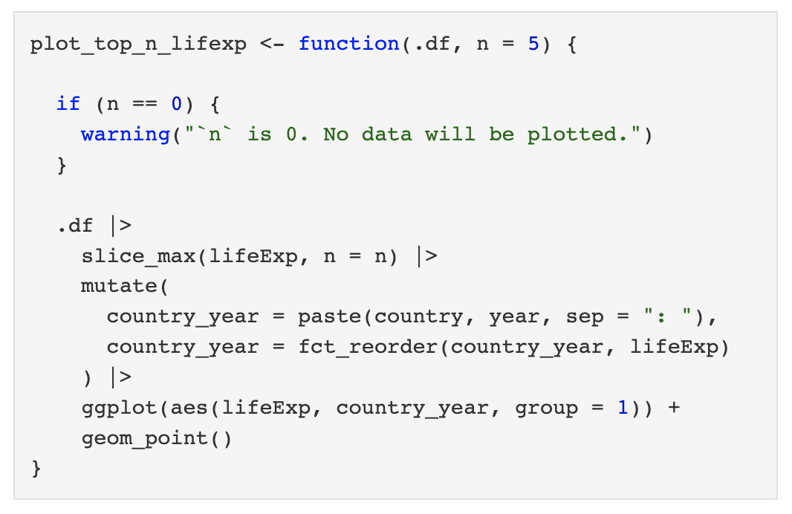
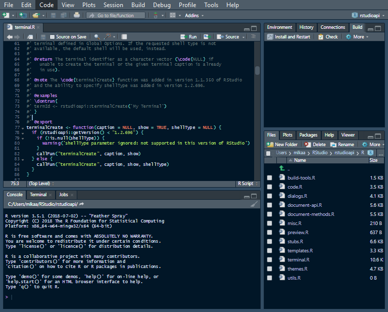
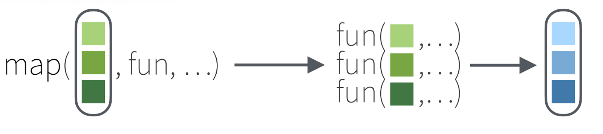
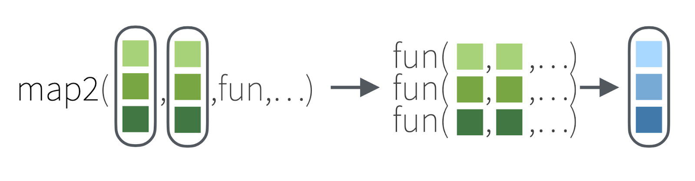
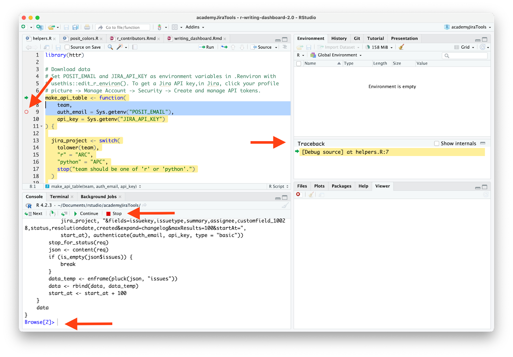
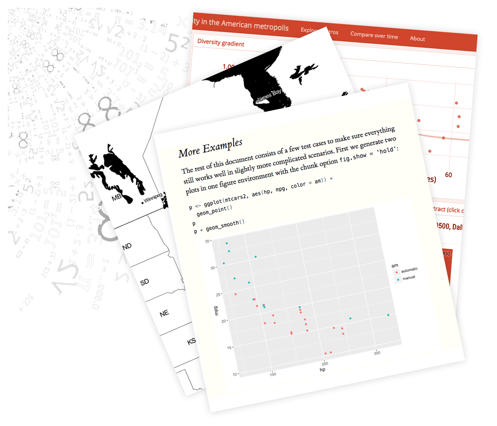

<!-- uncomment to include introductions during welcome -->
<!--  -->

<!-- defines strings for later slides -->


<!-- slides about course design -->


## Course Outline {.slide-white}

:::: {.columns}

::: {.column .fragment width=33%}

[Write functions]{style="margin: -4.465em auto 2em auto"}
:::

::: {.column .fragment width=33%}

[Organize projects]{style="margin: -5.795em auto 4.7em auto; color: white;"}

:::

::: {.column .fragment width=33%}
 

[Iterate with purrr]{style="margin: -3.4em auto 0 auto;"}
:::

::::

:::: {.columns style="margin-top: 7em;"}

::: {.column width=16%}
:::

::: {.column .fragment width=33%}

[Debug code]{style="margin: -4.25em auto 0 auto;"}
:::

::: {.column .fragment width=33%}

[Automate ETL, analysis, plots, and reports]{style="margin: -6.95em auto 0 auto;"}
:::

::: {.column width=16%}
:::

::::

::: notes
Over the next `{r} params$weeks` weeks, we'll be putting in this practice, with specific focus areas for each week. 

**[[weeks]]**

All of this will work toward understanding a shared data set.
:::

<!-- PROJECT - (Uncomment one below) -->

<!--  -->
<!--  -->

<!-- Near-final slides for tidyverse and pinr -->



