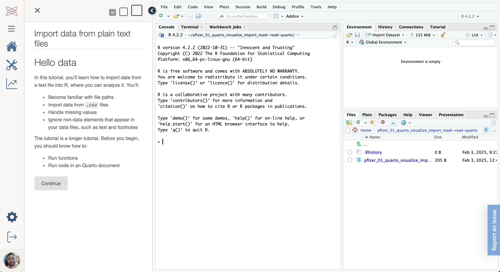

## Lessons - with inline feedback {.slide-white}

::: notes
Most of the tutorials look something like this, with inline feedback letting you know when you've done something right (or wrong.)
:::

::: {.content-hidden when-meta="params.new_campsite"}

## Lessons - in RStudio with sidebar {.slide-white} 

::: notes
Some of the tutorials look like this, with instructions in a sidebar and the RStudio interface on the right.
:::

:::

::: {.content-hidden when-meta="params.new_campsite"}
## Milestones in RStudio {.slide-white}
:::

::: {.content-hidden unless-meta="params.new_campsite"}
## Milestones in RStudio or Positron {.slide-white}
:::

::: notes
Finally, each week's milestone looks like this, following instructions inside a Quarto document in the RStudio interface.
:::
