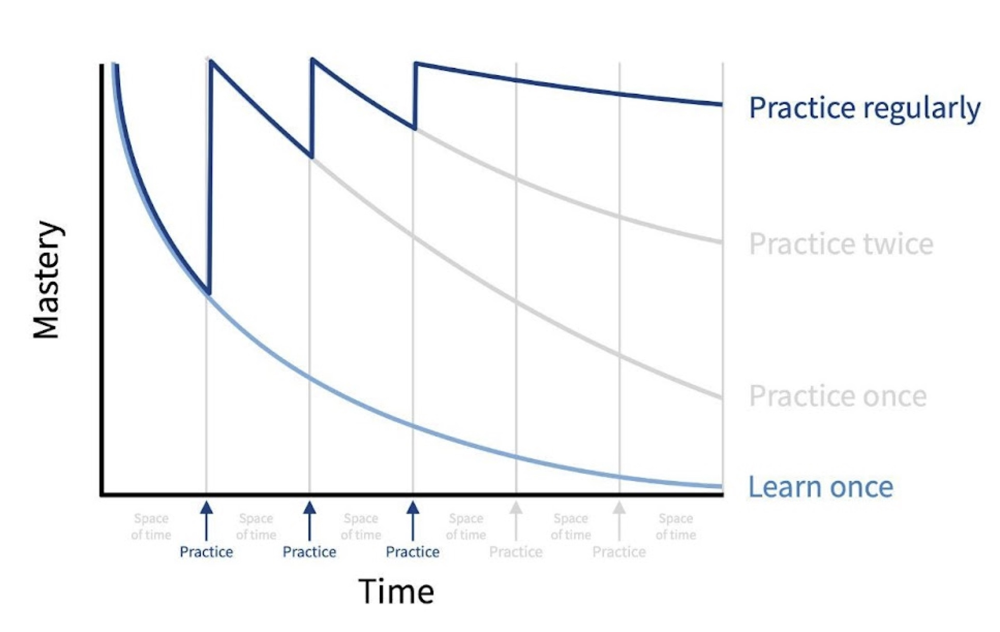
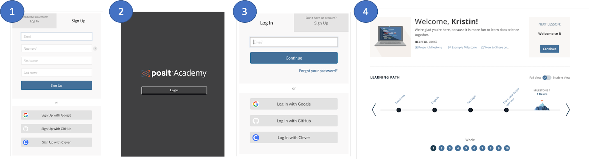
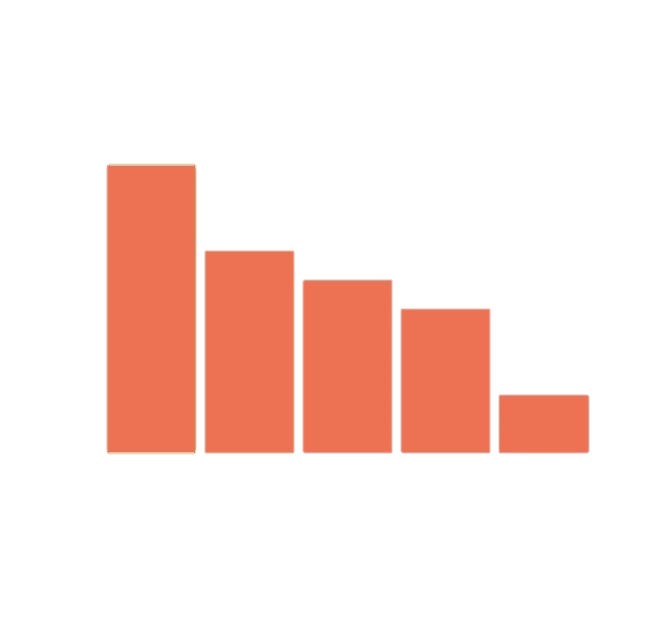
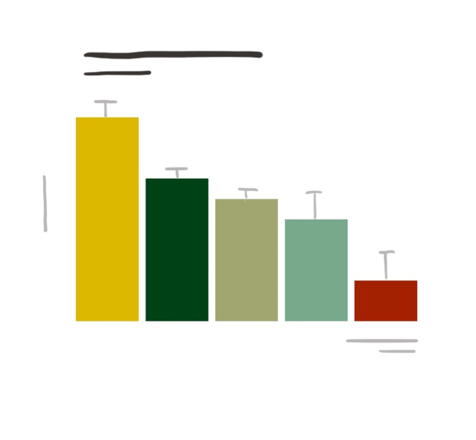

<!-- uncomment to include introductions during welcome -->
## Introductions


```{r}
#| include: false
library(stringr)
library(lubridate)
library(dplyr)
library(tibble)

# read raw .ics
lines <- readLines("calendar/invite.ics")

# handle possible line folding (important for some calendars)
lines <- gsub("^\\s+", "", lines)

# ---- isolate VEVENT block ----
start_idx <- grep("^BEGIN:VEVENT", lines)
end_idx   <- grep("^END:VEVENT", lines)

event_lines <- lines[start_idx:end_idx]

# ---- extract from event only ----
rrule_line   <- event_lines[grepl("^RRULE", event_lines)][1]
dtstart_line <- event_lines[grepl("^DTSTART", event_lines)][1]

# ---- parse RRULE ----
rrule <- str_remove(rrule_line, "RRULE:")
count <- str_extract(rrule, "COUNT=\\d+") |>
  str_remove("COUNT=") |>
  as.integer()

days <- str_extract(rrule, "BYDAY=[A-Z,]+") |>
  str_remove("BYDAY=") |>
  str_split(",") |>
  unlist()

# safety check
stopifnot(!is.na(count), length(days) > 0)

# ---- parse DTSTART ----
start_str <- str_extract(dtstart_line, "\\d{8}T\\d{6}")
start <- ymd_hms(start_str, tz = "Europe/London")

# ---- expand schedule ----
weekday_map <- c(MO=1, TU=2, WE=3, TH=4, FR=5, SA=6, SU=7)
day_offsets <- weekday_map[days] - 1  # Monday = 0

schedule <- tibble(
  n = 0:(count - 1),
  week = n %/% length(days),
  day_index = n %% length(days),
  date = floor_date(start, "week", week_start = 1) +
         weeks(week) +
         days(day_offsets[day_index + 1]) +
         hours(hour(start)) +
         minutes(minute(start))
) |>
  arrange(date) |>
  mutate(
    weekday = wday(date, label = TRUE),
    session_type = if_else(weekday %in% c("Tue"), "Collab", "Milestone")
  )

campsite_url <- htmltools::a(
  params$campsite,
  href = glue::glue("https://{params$campsite}"))

schedule_url <- htmltools::a(
  params$scheduler,
  href = glue::glue("https://{params$scheduler}"),
  style = "font-size: 0.7em;")

communication <- params$communication |> 
  stringr::str_to_title()

if (stringr::str_detect(tolower(params$communication), "teams") & stringr::str_detect(tolower(params$group), "pfizer") & stringr::str_detect(tolower(params$lesson1), "functions")) {
  communication_img <- htmltools::img(src="images/microsoft-teams-pfizer-pinr.png")
} else if (stringr::str_detect(tolower(params$communication), "teams") & stringr::str_detect(tolower(params$group), "pfizer")) {
  communication_img <- htmltools::img(src="images/microsoft-teams-pfizer.png")
} else if (stringr::str_detect(tolower(params$communication), "teams") & stringr::str_detect(tolower(params$group), "dow")) {
  communication_img <- htmltools::img(src="images/microsoft-teams-dow.png")
} else if (stringr::str_detect(tolower(params$communication), "teams")) {
  communication_img <- htmltools::img(src="images/microsoft-teams.png")
} else if (stringr::str_detect(tolower(params$communication), "slack") & stringr::str_detect(tolower(params$group), "mayo")) {
  communication_img <- htmltools::img(src="images/slack-mayo.png")
} else if (stringr::str_detect(tolower(params$communication), "slack")) {
  communication_img <- htmltools::img(src="images/slack.png")
}

mondays <- lubridate::floor_date(
  lubridate::as_date(rmarkdown::metadata$date) + (7 * (1:(params$weeks + 1))),
  unit = "week",
  week_start = 1) |> 
  {\(x) paste(lubridate::month(x, label = TRUE), lubridate::day(x))}()

new_campsite <- as.logical(params$new_campsite %||% FALSE)

if (new_campsite) {
  campsite_blank <- "images/campsite_new-blank.png"
  campsite_annotated <- "images/campsite_new-campsite.png"
  campsite_lessons <- "images/campsite_new-lessons.png"
  campsite_milestone <- "images/campsite_new-milestone.png"
  campsite_tracks <- "images/campsite_new-tracks.png"
  
  academy_lessons_a <- "images/academy_new-lesson-A.png"
  academy_milestone <- "images/academy_new-milestone.png"
} else {
  campsite_blank <- "images/campsite_old-blank.png"
  campsite_annotated <- "images/campsite_old-campsite.png"
  campsite_lessons <- "images/campsite_old-lessons.png"
  campsite_milestone <- "images/campsite_old-milestone.png"
  campsite_tracks <- "images/campsite_old-tracks.png"
  
  academy_lessons_a <- "images/academy_old-lesson-A.png"
  academy_milestone <- "images/academy_old-milestone.png"
}

```
:::: columns
::: {.column width="30%"}
{.staff-image}
:::

::: {.column width="70%"}
**Klaus Glanzer, Ph.D.** [(he/him)]{.faint} <br> Data Science Mentor

- Austria / Netherlands / Brazil
- using R & Python
- Posit Academy since 2024

:::
::::

::: notes
I'm Klaus Glanzer, a Data Science Mentor with Posit Academy. I'm in the North-East in Brazil currently enjoying the strong winds for kite surfing. Before I worked at the University of Groningen in the Netherlands teaching in electronics and data science. I am a bit more from the Python side but love the cleanlyness of R. ✻
:::


## Introductions [🎥 Cameras on, please]{style="float: right; font-size: 1.75rem; margin-top: 1em;"}

::: fragment
-   **Name** [(pronouns, optional)]{.faint}
-   **Geography**
-   **Motive**
    -   Why are you here? What do you do? ...and what do you do **with data**?
-   **Previous Experience**
    -   courses or workshops
:::


[pass to the next person...]{.faint style="float: right;"}

::: notes
Now tell us a bit about yourselves. We'll go around the room, choose the next person when you're done.

(introductions)

Awesome -- good to meet everyone! ✻
:::
 -->

## Getting Started with R

Reproducible, reliable data science using open source methods

-  Read and visualize
-  Summarize and explore
-  Join and tidy
-  Report and publish

::: notes
By the end of this course, you will be familiar with doing a number of things in R.
:::

<!-- defines strings for later slides -->
## Become `{r} params$become`. {.slide-marvel}


::: notes
If you've ever seen one of these shows or movies about becoming... `{r} params$become`... you probably remember that the early scenes show the budding hero trying something and being surprised when things *kind of work*, but also *kind of fail*. They're still getting used to their powers and they don't yet have a handle on... how the code works. Then we probably see a training montage as they try things out, practice different functions, read error messages, and delight in new milestones -- still sometimes getting things wrong, but shifting the balance as they improve over time. They want to master everything at once, but they learn that this isn't quite how anyone gets good at *coding* -- or anything, really.
:::

<!-- slides books into the heads design -->
## That would be nice


<!-- slides mentors give a push design -->
## That's what we are going to do


<!-- slides about course design -->
## Workshops {.untitled}

::: center
[60%]{style="font-size:4em;"} [  40%  ]{style="font-size:3em;"} [30%]{style="font-size:2em;"}
:::

**60%** can apply content immediately

**40%** six months later

**30%** one year after

-   [Saks, A.M. (2002). So what is a good transfer of training estimate? A reply to Fitzpatrick. The Industrial-Organizational Psychologist, 39(3), 29--30.](https://www.researchgate.net/profile/Alan_Saks/publication/239769006_So_What_is_a_Good_Transfer_of_Training_Estimate_A_Reply_to_Fitzpatrick/links/556f083808aeccd7774106f7.pdf)

::: notes
Despite this insight, we regularly see trainings offered in short, intensive workshops that run for one or two days. These are great for drumming up interest -- But the material doesn't always stick. In fact, *most* people forget *most* material from short intensive trainings. ✻
:::

## Forgetting curves {.center}



With regular use, we retain more.<br>
**Practice makes proficient.**

::: notes
Don't feel bad about it! Psychologists understand it like this: When we first learn something, we know it well but we begin to forget it almost immediately. Only through repetition can we approach mastery.

In other words, **practice makes proficient**.  ✻
:::


## Course Outline


1. Import and Visualize (`r paste(format(schedule$date[schedule$week == 0], "%b %d"), collapse = " & ")`)
2. Summarize Data (`r paste(format(schedule$date[schedule$week == 1], "%b %d"), collapse = " & ")`)
3. Wrangle Rows and Columns (`r paste(format(schedule$date[schedule$week == 2], "%b %d"), collapse = " & ")`)
4. Tidy and Join Tables (`r paste(format(schedule$date[schedule$week == 3], "%b %d"), collapse = " & ")`)
5. Work with Data Types (`r paste(format(schedule$date[schedule$week == 4], "%b %d"), collapse = " & ")`)

— Working Week (`r paste(format(schedule$date[schedule$week == 5], "%b %d"), collapse = " & ")`) —

6. *Choose your own adventure* (`r paste(format(schedule$date[schedule$week == 6], "%b %d"), collapse = " & ")`)

::: notes
Over the next `{r} params$weeks` weeks, we'll be putting in this practice, with specific focus areas for each week.

**[[weeks]]**

 (I'll come back to touch on that last week shortly.) All of this will work toward understanding a shared data set.
:::

<!-- PROJECT - (Uncomment one below) -->

<!--  -->

<!-- Near-final slides for tidyverse and pinr -->
## Structure of Academy

:::: columns
::: column
-  Campsite
-  Tutorials / Lessons
-  Milestones
:::

::: column
{.fragment .fade-in-then-out .absolute top=100 width="50%"}
{.fragment .fade-in-then-out .absolute top=100 width="50%"}
{.fragment .fade-in-then-out .absolute top=100 width="50%"}

{.fragment .fade-in .absolute top=100 width="50%"}
:::
::::

::: notes
- When we talk about the *campsite*, we mean the place where all the work gets done.
- Within that campsite, each week has *lessons* or *tutorials*...
- And it ends with the *milestone* where we get to apply the things we've learned.

**Let me switch tabs to show some of this interactively.**

- syllabus
- optional lessons
- weeks
- links at top
- users at bottom (add profile pic)
:::


## Signup process



1.  Go to [posit.cloud/plans/free](https://posit.cloud/plans/free). Click Sign Up. Use your work email to create a free Cloud account.
2.  Go to `{r} campsite_url`. Click Login.
3.  Enter your email and password from Step 1.
4.  🎉 You now have access to the Academy website.

::: notes
Before accessing the Academy website, we need to create a free account on Posit Cloud, using your work email. Once that's created, you can go to the site specific to this course and log in using those credentials.

Take a couple of minutes now to do just this. Please let me know if you run into issues. If you have successfully logged in, give me a thumbs up so we know you have successfully logged in.

(time passes)

That looks like most people have successfully logged in -- if you have any specific issues, we can look at those at the end of this call. ✻
:::


## Weekly breakdown {.untitled}



::: notes
We can think of each week in Academy as made up of blocks of time or attention. The first part of the week will be working through interactive *lessons*. **[CLICK]**  The second part will be devoted toward the *milestone* **[CLICK]**.✻
:::

## Lessons - with inline feedback


::: notes
Most of the tutorials look something like this, with inline feedback letting you know when you've done something right (or wrong.)
:::

::: {.content-hidden when-meta="params.new_campsite"}

## Lessons - in RStudio with sidebar 


::: notes
Some of the tutorials look like this, with instructions in a sidebar and the RStudio interface on the right.
:::

:::

::: {.content-hidden when-meta="params.new_campsite"}
## Milestones in RStudio
:::

::: {.content-hidden unless-meta="params.new_campsite"}
## Milestones in RStudio or Positron
:::


::: notes
Finally, each week's milestone looks like this, following instructions inside a Quarto document in the RStudio interface.
:::


## Milestone structure {.center}

:::: columns
::: {.column .fragment width="33%"}

:::

::: {.column .fragment width="33%"}
::: {style="background-color:#FFFFFF;"}

Recreation
:::
:::

::: {.column .fragment width="33%"}
::: {style="background-color:#FFFFFF;"}

Extension
:::
:::
::::

::: notes
Each of these milestones will follow a repeated pattern:
- The milestone will contain an artifact **\[CLICK\]**, like a table or a graph made using the project data.
- You'll have a week to apply the skills you've learned to try to
-   **(1) recreate that artifact \[CLICK\] and**
-   **(2) extend the milestone \[CLICK\] to answer some question by modifying it or adding to it, often using something new about R that you've explored on your own.**

This is your chance to explore something new about R. Use the milestone to stretch your limits and try out something \* *not* \* taught in a tutorial.

Becoming a `{r} params$become` means gaining comfort in teaching yourself new R skills---and this is something that we want to explicitly give you experience with in Academy. ✻
:::


## `{r} params$weeks` weeks, `{r} params$weeks` milestones {.center .slide-stickies}

::: notes
This cycle repeats over the `{r} params$weeks` weeks, building up `{r} params$weeks` progressive milestones into one finished project. This way, you'll chew on bite-sized pieces in order to finish the larger meal working one week at time. We're working with some complex data, so it's good that we can break it down like this. ✻
:::


## Weekly breakdown {.untitled}



::: notes
We meet together twice a week -- once to go over questions from the lessons and another time to share milestones -- but you'll also devote time to working through the material on your own.
:::

## `{r} communication`

`{r} communication_img`

::: notes
Between our meetings, you have access to a group on `{r} communication` that we'll use for announcements, questions, team encouragement --- you name it! In addition to this, we'll also use it to build connections across your group and to share code. One of our hopes is that by the end of Academy, you will have a community of peers which will be useful as you move forward in your work with R. ✻
:::


## Week 6: *Choose your adventure*

:::: {columns}
::: {.column}

Option of three tracks:

1. Report and Publish
2. Data Visualization
3. Transform and Model

::: {.callout-note appearance="simple" style="margin-right: 7%;"}
`{r} ifelse(as.logical(params$new_campsite %||% FALSE), "We'll talk more about this in a later week.", "They look like three weeks, but each is available for selection.")`
:::
:::

::: {.column}

{.absolute top=100 width="50%"}
:::
::::

::: notes
And all of this helps you build confidence into the final week, where you get to *choose your own adventure*. Three tracks give you a chance to dive more deeply into a topic you care about. They're distributed across what looks like three "weeks" in the interface, but you'll be able to skip to whichever you want. ✻
:::

## Next Actions

1. [ ] Confirm access: `{r} campsite_url`
2. [ ] Introduce yourself on `{r} communication`
3. [ ] Schedule a 1:1 `{r} schedule_url`
4. [ ] Block off time *daily* for Academy
5. [ ] Lesson 1: `{r} params$lesson1`

::: notes
That brings us to the end of what I've prepared, and I'm happy to open the floor to questions.

Thanks all! Go ahead and get started on the first week's material, and we'll see you at your first collaboration session next week! ...

If anyone still has login issues, stick around and we can work on those in real time right now. ✻
:::

## Thank you